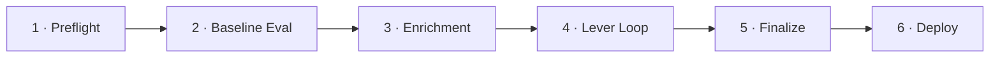
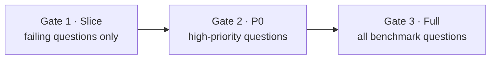

# Auto-Optimize (GSO)

Auto-Optimize is a benchmark-driven optimization pipeline that measures Genie Space accuracy, diagnoses failures, and iteratively applies metadata patches until quality thresholds are met. It is powered by the Genie Space Optimizer (GSO) engine — a separate Python package at `packages/genie-space-optimizer/`.

## Overview

Unlike the [IQ Scanner](/docs/features/iq-scanner) (which produces instant rule-based findings), Auto-Optimize runs a **closed-loop pipeline**: it generates benchmarks, evaluates Genie's generated SQL against expected answers using specialized judges, identifies failure patterns, proposes and tests metadata changes, and only commits changes that pass multi-stage evaluation gates.

## The 6-Task Pipeline

The optimization runs as a Databricks Lakeflow Job with six sequential tasks:

### Task Details

| # | Task | Purpose | Key Actions |
|---|------|---------|-------------|
| 1 | **Preflight** | Validate prerequisites | Check SP permissions, verify benchmark questions, validate table access, ensure Prompt Registry is enabled |
| 2 | **Baseline Evaluation** | Measure current accuracy | Run all benchmark questions through Genie, evaluate with 9 judges, establish baseline score |
| 3 | **Enrichment** | Gather optimization context | Proactive metadata enrichment — profile tables, analyze query patterns, identify improvement opportunities |
| 4 | **Lever Loop** | Iterative optimization | The core loop: cluster failures → pick levers → generate patches → 3-gate evaluation → accept or rollback |
| 5 | **Finalize** | Consolidate results | Merge accepted patches, validate final configuration, compute final accuracy |
| 6 | **Deploy** | Apply to space | Optionally apply the optimized configuration to the live Genie Space |

## The 5 Lever Categories

Levers are categories of metadata changes the optimizer can apply. Each lever targets a different aspect of the space configuration:

| Lever | Target | Examples |
|-------|--------|----------|
| **Tables/Columns** | Table and column metadata | Add descriptions, synonyms, entity matching, format assistance |
| **Metric Views** | Pre-computed metric definitions | Add metric views for common aggregations |
| **TVFs (Table-Valued Functions)** | Custom SQL functions | Add TVFs for complex business logic |
| **Join Specs** | Table relationship definitions | Add or refine join specifications between tables |
| **Instructions/Example SQL** | Behavioral guidance | Add text instructions, example SQL pairs, SQL snippets (filters, measures, expressions) |

The lever loop's **strategist** analyzes current failure patterns and selects the lever category most likely to address them.

## 3-Gate Evaluation

Before accepting any set of patches, the optimizer runs them through three progressively broader evaluation gates:

| Gate | Scope | Purpose |
|------|-------|---------|
| **Slice** | Only the questions that currently fail | Quick check — did the patches fix the targeted failures? |
| **P0** | High-priority / critical questions | Regression check — did we break anything important? |
| **Full** | All benchmark questions | Complete evaluation — net accuracy improvement |

If a patch set fails at any gate, it is **rolled back** and the optimizer tries a different approach. The strategist records the failure in a reflection buffer to avoid retrying the same strategy.

## 9 Specialized Judges

Accuracy evaluation uses 9 specialized judges that compare Genie's generated SQL against expected benchmark answers:

Each judge evaluates a different dimension of SQL correctness (e.g., table selection, join logic, filter conditions, aggregation, column selection, output format). A question is considered "correct" when it passes the required subset of judges.

Judge prompts are managed via **MLflow Prompt Registry**, providing version control and traceability for evaluation criteria.

## Convergence

The lever loop terminates when one of three conditions is met:

| Status | Condition | Meaning |
|--------|-----------|---------|
| `CONVERGED` | Accuracy target reached (typically ≥ 85%) | Optimization succeeded |
| `STALLED` | No improvement across consecutive iterations | Further optimization is unlikely |
| `MAX_ITERATIONS` | Iteration limit reached | Time-boxed stop |

The IQ Scanner checks for terminal GSO runs when evaluating checks 11 and 12. A `CONVERGED` run with `best_accuracy ≥ 85%` satisfies both checks.

## Data Persistence

Auto-Optimize stores all state in **12 Delta tables** under `GSO_CATALOG.GSO_SCHEMA`:

| Table | Contents |
|-------|----------|
| `genie_opt_runs` | Run metadata: status, accuracy, timestamps, config |
| `genie_opt_iterations` | Per-iteration evaluation results |
| `genie_opt_patches` | All patches generated (accepted and rejected) |
| `genie_opt_suggestions` | Strategist suggestions per iteration |
| `genie_opt_eval_results` | Detailed per-question evaluation results |
| `genie_opt_asi_results` | ASI (judge) results per question per iteration |
| `genie_opt_benchmarks` | Benchmark question definitions |
| `genie_opt_enrichments` | Proactive enrichment data |
| `genie_opt_lever_configs` | Lever configuration per run |
| `genie_opt_space_snapshots` | Space config snapshots (before/after) |
| `genie_opt_failure_clusters` | Failure pattern clusters |
| `genie_opt_reflection` | Reflection buffer (what worked, what didn't) |

The Workbench frontend reads this data through `backend/routers/auto_optimize.py`, which queries Lakebase synced tables (preferred) or falls back to direct Delta queries via the SP.

## Permission Model

The optimization job runs entirely as the app's **Service Principal** (SP). See [Authentication & Permissions](/docs/platform/authentication) for the full security model, including:

- Why jobs can't use OBO
- How user authorization is verified before job submission
- What SP permissions are required

## MLflow Integration

- **Experiment tracking**: each optimization run is tracked as an MLflow experiment
- **Prompt Registry**: judge prompts are versioned in MLflow Prompt Registry, enabling reproducible evaluations
- **`MLFLOW_EXPERIMENT_ID`**: configured in `app.yaml`, validated at startup

:::warning
MLflow Prompt Registry must be enabled on the workspace. If disabled, the preflight task will fail with `FEATURE_DISABLED`.
:::

## Triggering from the UI

Users trigger optimization from the **Optimize** tab in the Space Detail view:

1. The UI calls `GET /api/auto-optimize/permissions/{space_id}` to pre-check SP access
2. User configures options (apply mode, levers) and clicks "Optimize"
3. `POST /api/auto-optimize/trigger` starts the job (see [trigger flow](/docs/platform/authentication#optimization-trigger-flow))
4. The UI polls `GET /api/auto-optimize/runs/{run_id}/status` for progress
5. On completion, the user can review patches and choose to apply or discard

## Source Files

- `packages/genie-space-optimizer/` — the GSO engine package
- `backend/routers/auto_optimize.py` — 16 API endpoints for GSO management
- `backend/services/gso_lakebase.py` — synced table reads
- `backend/main.py` — `_ensure_gso_job_run_as()` startup hook
- `databricks.yml` — job definition for the optimization DAG

## Related Documentation

- [Authentication & Permissions](/docs/platform/authentication) — SP-based execution model
- [IQ Scanner](/docs/features/iq-scanner) — checks 11–12 evaluate optimization results
- [Operations Guide](/docs/platform/operations) — managing the GSO job
